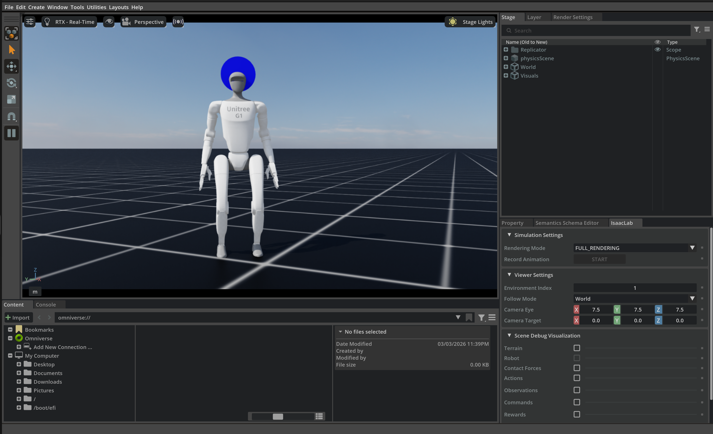

## Tutorial: G1 Standing with PPO

In this hands-on tutorial, you will train a **G1 humanoid** to stand still on flat terrain using **PPO** in Isaac Lab.

> **Figure:** The end result of this lab – a G1 humanoid that can stand upright on flat terrain using a learned PPO policy.

You will:

- Reuse Isaac Lab’s built-in G1 flat locomotion config.
- Specialize it into a **standing** task by changing commands and rewards.
- Register two Gym environments:
  - `G1-Stand-Flat-v0` (training)
  - `G1-Stand-Flat-Play-v0` (play/visualization)
- Configure an RSL-RL PPO runner for this task.
- Train the policy and visualize the result in Isaac Lab.

### Prerequisites

You should:

- Be comfortable with Python.
- Have basic RL knowledge (states, actions, rewards, episodes).
- Have Isaac Lab installed and working.
- Have the `g1_stand` extension project checked out under `<G1_STAND_ROOT>`.

If you haven’t yet:

- See **Getting started → Installation** for environment setup.
- See **Getting started → Isaac Lab basics** and **RL basics** for quick conceptual refreshers.

### Tutorial flow

This tutorial is organized as:

1. **Define the standing environment**
2. **Register Gym environments**
3. **Configure PPO for the standing task**
4. **Train the G1 standing policy** (install the extension first if needed; see README)
5. **Visualize the learned behavior**
6. **Troubleshoot and extend**

Use the navigation under **Tutorials → G1 standing PPO** to follow each step.

